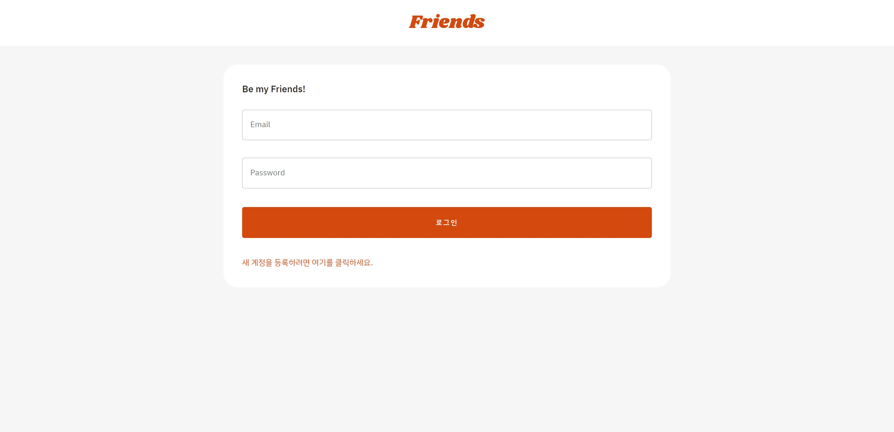
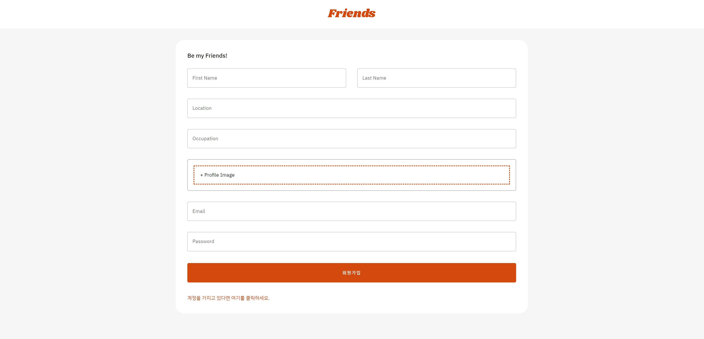
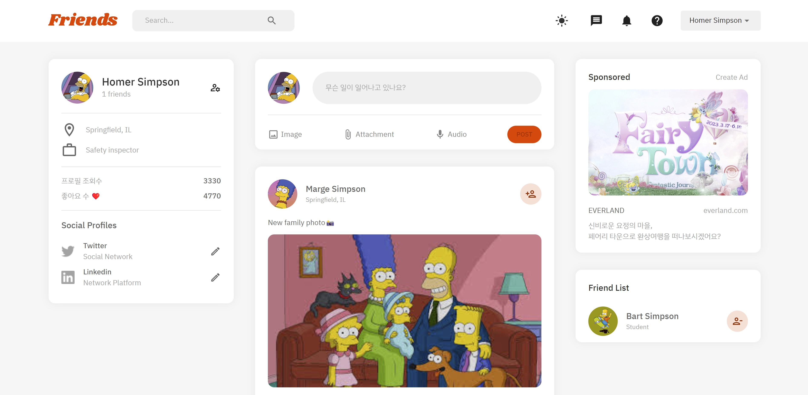
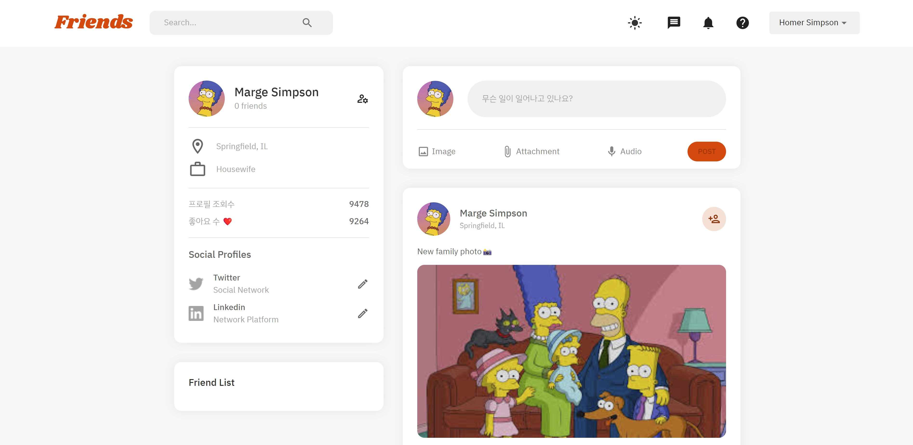
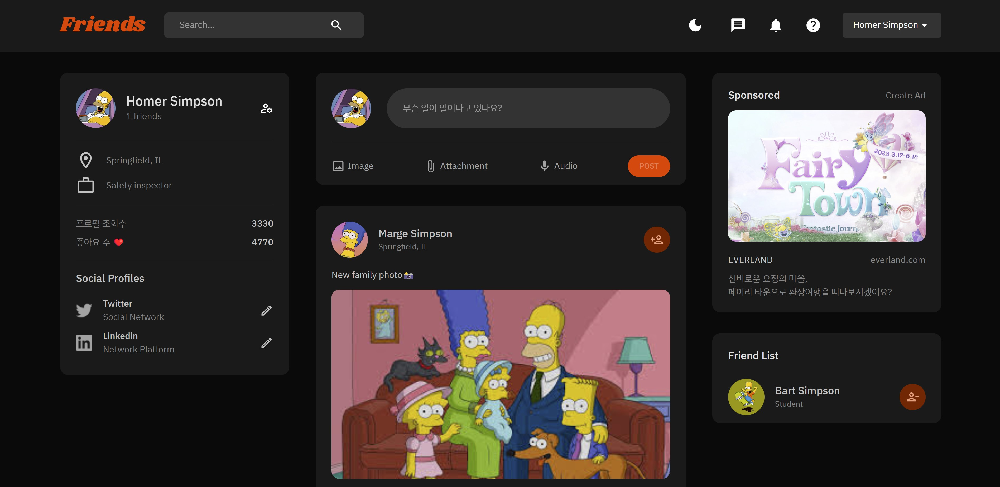

# Friends
소셜 네트워크 서비스(SNS)

 

### 🖥️ 프로젝트 목표
- 리액트로 반응형 웹 어플리케이션 만들기.

 

### 🕰️ 개발 기간
- 2023.04.24 ~ 2023.04.30 (1주일)

 

### 👩🏻‍💻 개발 인원
- 1명 (개인 프로젝트)

 

### 🛠️ 개발 환경
- 
Frontend 

&nbsp;&nbsp;&nbsp;&nbsp;&nbsp;

- 
Backend 

&nbsp;&nbsp;&nbsp;&nbsp;&nbsp;

- 
Database 

&nbsp;&nbsp;&nbsp;&nbsp;&nbsp;

- 
Editor 

&nbsp;&nbsp;&nbsp;&nbsp;&nbsp;

- 
VCS

&nbsp;&nbsp;&nbsp;&nbsp;&nbsp;

  

### 🔎 구현 동작
- 인트로

- 로그인

- 회원가입

- 메인

- 다른 유저 프로필 보기

- 다크모드

 

### 📽️ 시연 영상
- https://youtu.be/md53Az9ibuM

 

## 📑 Private Message 사용법
- Frontend 서버 접속 : 터미널에 cd client > npm run start
- Backend 서버 접속 : 터미널에 cd server > npm run start